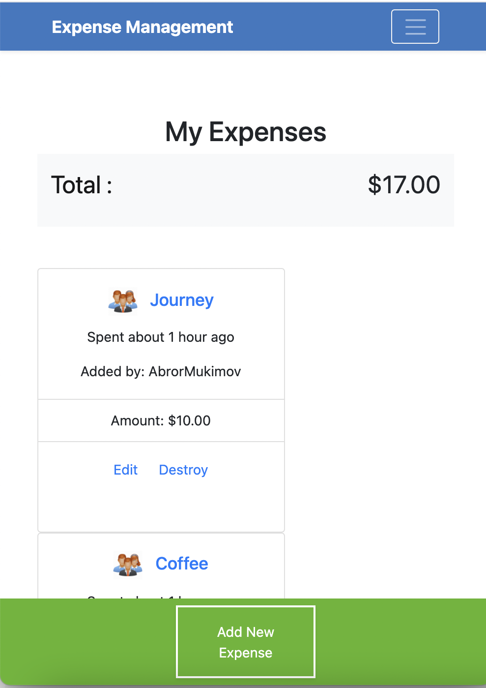

# Expense Management - Ruby on Rails Capstone Project

> Track and Group your Expenses




Created with Ruby on Rails which helps you manage your Expenses and store Group images in AWS in Production Environment.

## Built With

- Ruby on Rails
- Devise Gem for authentication
- RSpec, Capybara, FactoryBot and Shoulda-matchers for model, controller and unit testing
- Databases: SQLite3 in development and testing, PostgresQL for production

## Live Demo

- [Live Demo Link](https://rajda-expense-mgmt.herokuapp.com)

## Getting Started

To get a local copy up and running follow these simple example steps.

### Prerequisites

1. Have Ruby 2.7.0 installed
2. Have Rails 6 installed

### Setup

1. Clone this repo to your computer using <code>git clone</code> and the web url
2. Open your terminal and <code>cd</code> into the project root directory

### Install

1. Run <code>bundle install</code>
2. Install yarn packages as the terminal will prompt you to do
3. Run <code>rails db:create</code>
4. Run <code>rails db:migrate</code>
5. Run <code>Rails s</code> to start the server

### Usage

1. Open your browser at <code>localhost:3000</code>
2. Sign up and start creating Expenses and Groups

### Run tests

Run the following within the project directory:

```
    rpsec
```

## Authors

👤 **Abror Mukimov**

- Github: [@abrormukimov](https://github.com/abrormukimov)
- Twitter: [@abrormukimov](https://twitter.com/abrormukimov)
- Linkedin: [Abror Mukimov](https://www.linkedin.com/in/abror-mukimov/)

## 🤝 Contributing

Contributions, issues and feature requests are welcome!

## Show your support

Give a ⭐️ if you like this project!

## Acknowledgments

- Thanks to [Gregoire Vella](https://www.behance.net/gregoirevellaDesign) for the design idea

## 📝 License

This project is [MIT](lic.url) licensed.